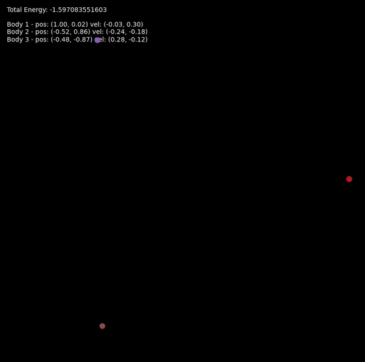
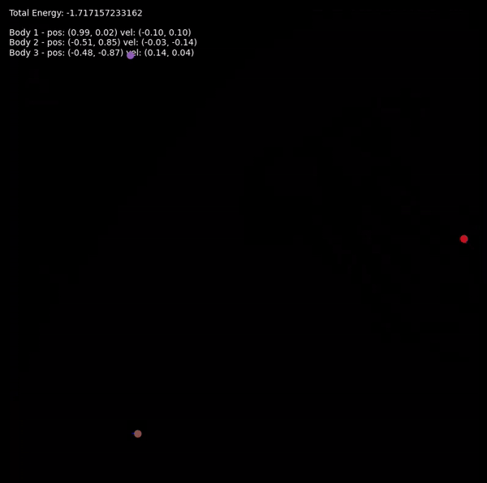

# Three-Body Problem Simulator

This project is a Python-based simulator for the three-body problem in celestial mechanics. It was created for Analysis 4 course.

## Project Description

The three-body problem is a classical problem in physics and mathematics that involves predicting the motion of three bodies interacting through gravitational forces. This simulator uses numerical methods to solve the differential equations defining the motion of three bodies in a two-dimensional plane.

## Authors

- Maja Milenković
- Veljko Prodan

## Features

- Implements the Runge-Kutta 4th order method (RK4) and 3/8 rule for numerical integration
- Offers both regular and softened versions of the equations of motion
- Calculates and displays the total energy of the system
- Provides several preset initial conditions and allows for custom input
- Generates an animated visualization of the three-body system

## Visualization

The animation shows:
- The paths of the three bodies (red, green, and blue lines)
- The current positions of the bodies (colored dots)
- Real-time updates of total energy, positions, and velocities

  
  

